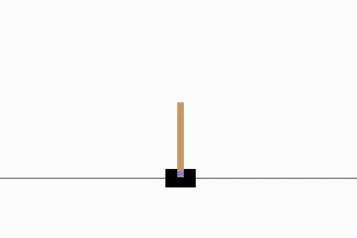
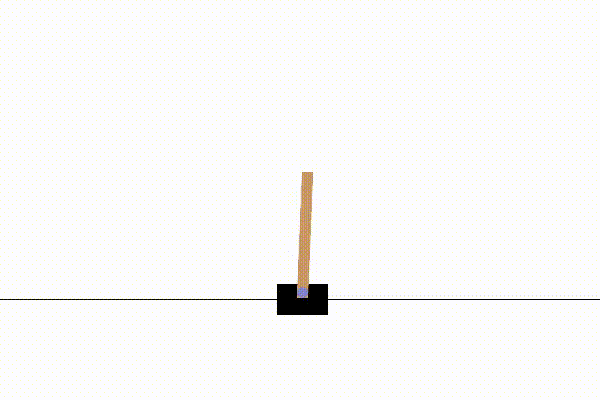
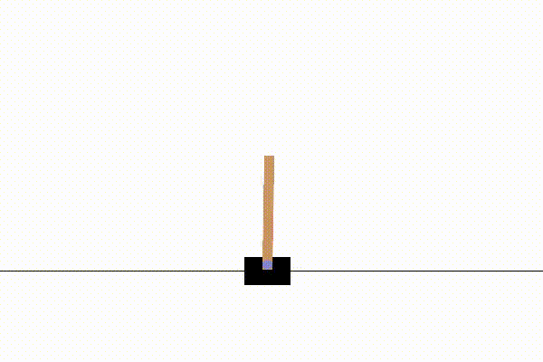
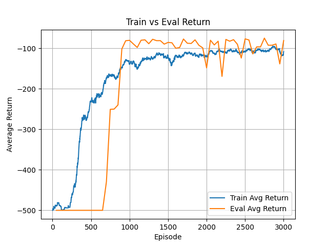
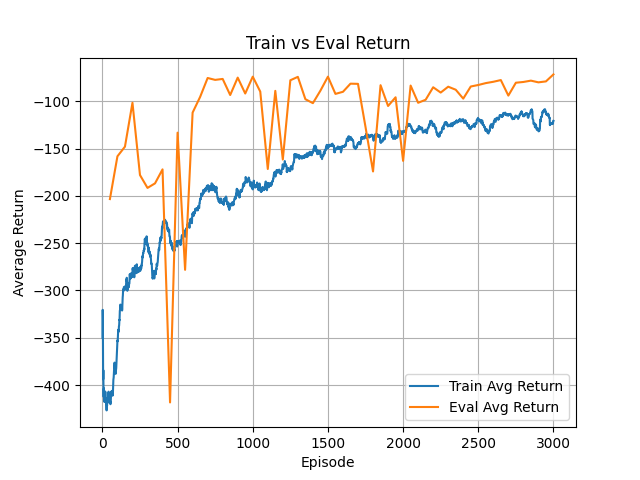
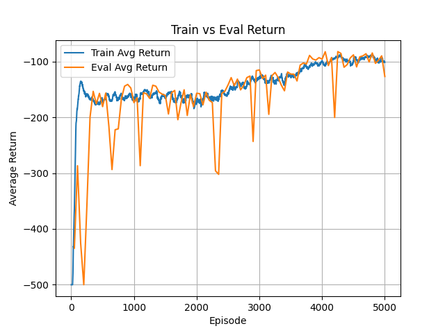
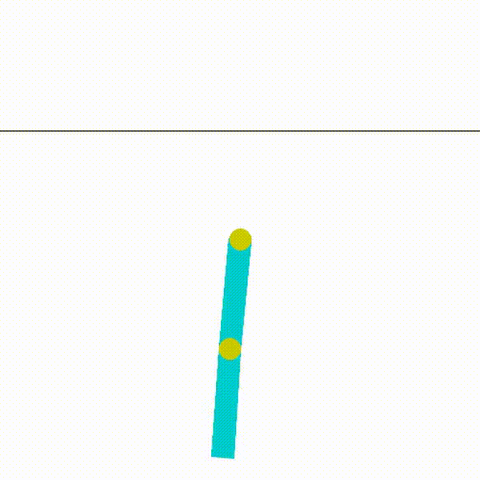
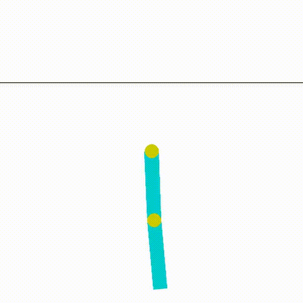
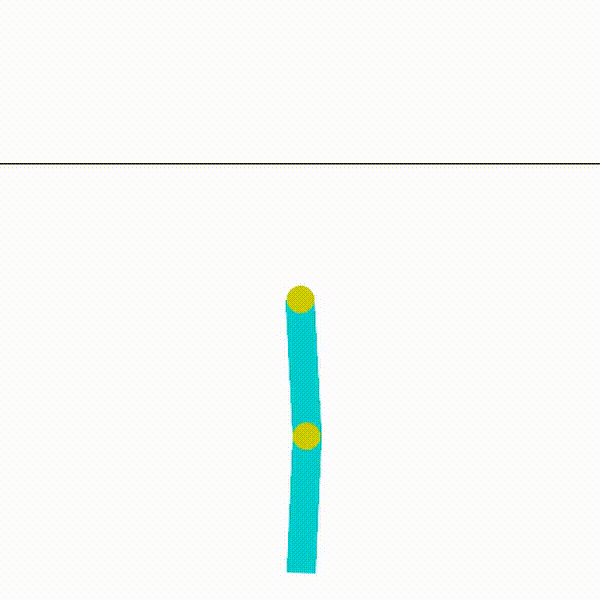
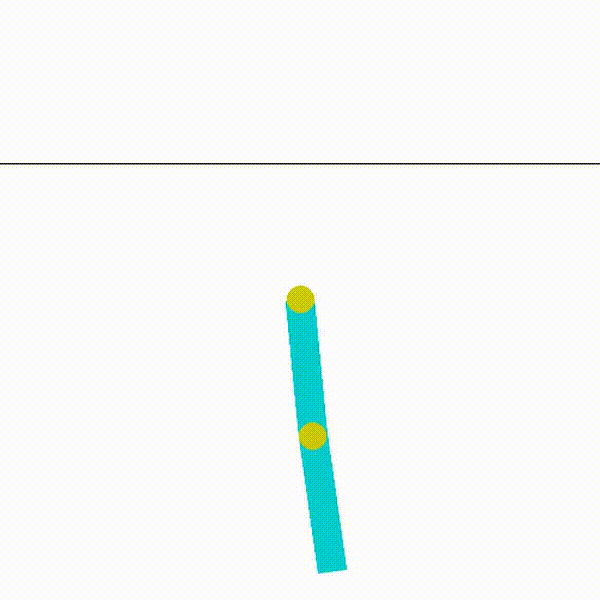

<!-- # Policy Gradient using REINFORCE on CartPole

## Overview

This project implements a basic **Policy Gradient Reinforcement Learning algorithm (REINFORCE)** using PyTorch and Gymnasium on the CartPole-v1 environment.

The agent learns to balance a pole on a moving cart by directly learning a policy that maps states to action probabilities.

---

# Environment

## CartPole-v1

The environment consists of:
- A cart moving left/right
- A pole attached to the cart

Goal:
- Keep the pole balanced upright for as long as possible

---

# State Space

The environment provides a 4-dimensional state:

$$
[x,\dot{x},\theta,\dot{\theta}]
$$

Where:

| Variable | Meaning |
|---|---|
| $x$ | Cart Position |
| $\dot{x}$ | Cart Velocity |
| $\theta$ | Pole Angle |
| $\dot{\theta}$ | Pole Angular Velocity |

---

# Action Space

The agent can take 2 discrete actions:

| Action | Meaning |
|---|---|
| 0 | Push Cart Left |
| 1 | Push Cart Right |

---

# Reward

The environment provides:

$$
+1
$$

reward for every timestep the pole remains balanced.

Thus:

$$
\text{Total Reward} = \text{Episode Length}
$$

---

# Results of Trajectory

# Episode 0



# Episode 400



# Episode 800



---

# Policy Gradient Idea

Instead of learning Q-values, the policy network directly learns:

$$
\pi_\theta(a|s)
$$

which represents:
- probability of taking action $a$
- given state $s$

---

# Policy Network

The neural network:
- takes state as input
- outputs action probabilities

Architecture:

```python
Input: 4
Hidden Layer: 128
Output: 2
Activation: ReLU + Softmax
```

Example output:

```python
[0.3, 0.7]
```

Meaning:
- 30% probability of moving left
- 70% probability of moving right

---

# Action Sampling

Actions are sampled using a categorical probability distribution.

```python
distribution = Categorical(probs)
action = distribution.sample()
```

This allows:
- stochastic exploration
- probabilistic behavior

---

# Discounted Returns

For each timestep:

$$
G_t = r_t + \gamma r_{t+1} + \gamma^2 r_{t+2} + ...
$$

Where:
- $G_t$ = discounted future reward
- $\gamma$ = discount factor

This gives more importance to:
- actions that helped long-term survival

---

# Return Computation

Returns are computed backward using:

$$
G_t = r_t + \gamma G_{t+1}
$$

---

# REINFORCE Loss

The loss function used is:

$$
L = -\sum_t \log \pi_\theta(a_t|s_t) G_t
$$

Where:
- $\log \pi_\theta(a_t|s_t)$ = log probability of chosen action
- $G_t$ = discounted return

Intuition:
- good actions become more probable
- bad actions become less reinforced

---

# Training Process

For every episode:

1. Reset environment
2. Run episode using current policy
3. Store:
   - states
   - actions
   - rewards
   - log probabilities
4. Compute discounted returns
5. Normalize returns
6. Compute policy gradient loss
7. Backpropagate loss
8. Update policy network

---

# Optimization

Optimizer used:

```python
Adam
```

Learning Rate:

```python
0.001
```

---

# Video Recording

Training videos are recorded every 100 episodes using:

```python
RecordVideo
```

Videos are stored in:

```text
videos/
```

---

# Libraries Used

- PyTorch
- Gymnasium
- NumPy

---

# Conclusion

This project implements a complete vanilla Policy Gradient pipeline using REINFORCE on CartPole.

The agent learns entirely through:
- interaction with the environment
- reward signals
- policy optimization

without any supervised labels or expert trajectories. -->


# Policy Gradient Algorithms on Acrobot

This project implements and compares three policy-gradient based reinforcement learning algorithms on the `Acrobot-v1` environment:

- REINFORCE
- Monte Carlo Actor-Critic
- TD Actor-Critic

---

## Environment: Acrobot-v1

Acrobot is a two-link robotic arm. The top joint is fixed, and the agent controls the torque at the middle joint.

The goal is to swing the lower tip of the arm above a target height.

Unlike CartPole, Acrobot is not about balancing. It is about building momentum over multiple steps.

```text
Initial behavior:
flails randomly

Learned behavior:
swing → swing → swing → tip crosses target height
```

---

## Reward Structure

Acrobot gives:

$$
-1
$$

reward at every timestep until the goal is reached.

So the return is negative:

```text
Return = -number_of_steps_taken
```

This means:

| Return | Meaning |
|---:|---|
| -500 | Failed or took max time |
| -200 | Poor |
| -100 | Good |
| -70 | Very good |
| closer to 0 | Better |

A policy with return around `-70` solves the task much faster than one with return around `-500`.

---

## Algorithms Implemented

### 1. REINFORCE

REINFORCE directly updates the policy using discounted returns.

Policy loss:

$$
L = -\sum_t \log \pi_\theta(a_t|s_t)G_t
$$

where:

$$
G_t = r_t + \gamma r_{t+1} + \gamma^2r_{t+2}+...
$$

This method is simple but high variance.

---

### 2. Monte Carlo Actor-Critic

Monte Carlo Actor-Critic adds a learned value baseline.

The actor learns the policy:

$$
\pi_\theta(a|s)
$$

The critic learns the state value:

$$
V_\phi(s)
$$

The advantage is:

$$
A_t = G_t - V_\phi(s_t)
$$

Actor loss:

$$
L_{actor} = -\log \pi_\theta(a_t|s_t)A_t
$$

Critic loss:

$$
L_{critic} = (V_\phi(s_t)-G_t)^2
$$

This reduces variance compared to REINFORCE.

---

### 3. TD Actor-Critic

TD Actor-Critic updates after every environment step using the TD error.

TD target:

$$
r_t + \gamma V(s_{t+1})
$$

TD error:

$$
\delta_t = r_t + \gamma V(s_{t+1}) - V(s_t)
$$

Actor loss:

$$
L_{actor} = -\log \pi_\theta(a_t|s_t)\delta_t
$$

Critic loss:

$$
L_{critic} = \delta_t^2
$$

TD learning gives faster feedback because it does not wait for the full episode to finish.

---

## Results on Acrobot-v1

In Acrobot, rewards are negative because the agent receives `-1` at every timestep until the episode ends. Therefore, returns closer to `0` indicate shorter episodes and generally better task completion.

| Algorithm | Episodes | Observed Behavior |
|---|---:|---|
| REINFORCE | 3000 | Improves from around `-500` toward around `-100` |
| MC Actor-Critic | 3000 | Improves more gradually, with eval returns often near `-80` to `-100` |
| TD Actor-Critic | 5000 | Learns steadily and reaches around `-100` eval return |

## Training Curves

### REINFORCE



### Monte Carlo Actor-Critic



### TD Actor-Critic



In Acrobot, rewards are negative because the agent receives `-1` at every timestep until the episode ends. Therefore, returns closer to `0` indicate shorter episodes and generally better task completion.

| Algorithm | Episodes | Observed Behavior |
|---|---:|---|
| REINFORCE | 3000 | Improves from around `-500` toward around `-100` |
| MC Actor-Critic | 3000 | Improves more gradually, with eval returns often near `-80` to `-100` |
| TD Actor-Critic | 5000 | Learns steadily and reaches around `-100` eval return |

## Policy Behavior GIFs

## Initial State



### REINFORCE



### Monte Carlo Actor-Critic



### TD Actor-Critic




---

## How to Train

### REINFORCE

```bash
python main.py \
--algo reinforce \
--env Acrobot-v1 \
--episodes 3000 \
--actor_lr 3e-4 \
--gamma 0.99 \
--model_name models/acrobot_reinforce \
--log_file logs/acrobot_reinforce.txt \
--plot_file plots/acrobot_reinforce.png
```

### Monte Carlo Actor-Critic

```bash
python main.py \
--algo mc_ac \
--env Acrobot-v1 \
--episodes 3000 \
--actor_lr 1e-4 \
--critic_lr 3e-4 \
--gamma 0.99 \
--model_name models/acrobot_mc_ac \
--log_file logs/acrobot_mc_ac.txt \
--plot_file plots/acrobot_mc_ac.png
```

### TD Actor-Critic

```bash
python main.py \
--algo td_ac \
--env Acrobot-v1 \
--episodes 5000 \
--actor_lr 5e-5 \
--critic_lr 3e-4 \
--gamma 0.99 \
--model_name models/acrobot_td_ac \
--log_file logs/acrobot_td_ac.txt \
--plot_file plots/acrobot_td_ac.png
```

---

## Run All Experiments

```bash
python run.py
```

This runs all configured experiments and saves:

```text
logs/
models/
plots/
videos/
```

---

## Inference

```bash
python inference.py \
--env Acrobot-v1 \
--model_path models/acrobot_td_ac_best_policy.pth \
--inference_episodes 5
```

To save inference videos:

```bash
python inference.py \
--env Acrobot-v1 \
--model_path models/acrobot_td_ac_best_policy.pth \
--inference_episodes 5 \
--save_video \
--video_folder inference_videos/acrobot_td_ac
```

---

## Project Structure

```text
.
├── algorithms/
│   ├── reinforce.py
│   ├── mc_actor_critic.py
│   └── td_actor_critic.py
├── args.py
├── inference.py
├── main.py
├── network.py
├── run.py
├── utils.py
├── logs/
├── models/
├── plots/
└── videos/
```

---

## Key Takeaways

- REINFORCE is simple but noisy.
- Monte Carlo Actor-Critic reduces variance using a learned value baseline.
- TD Actor-Critic learns from every step using bootstrapping.
- Acrobot is harder than CartPole because it requires momentum-building and delayed credit assignment.
- Negative returns are normal in Acrobot; closer to zero is better.

---

## Libraries Used

- PyTorch
- Gymnasium
- NumPy
- Matplotlib